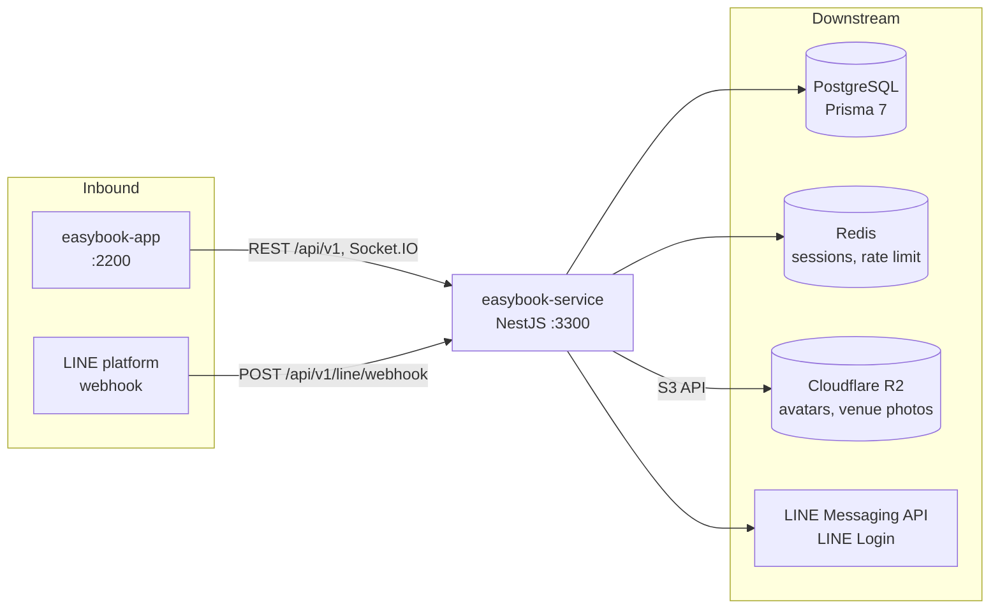
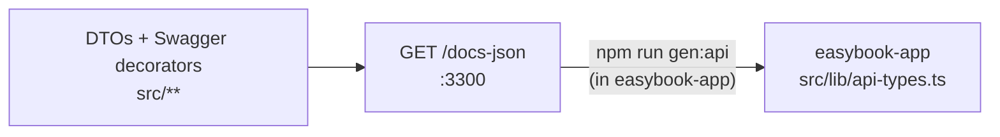

# EasyBook - Service Backend

> REST, realtime and LINE webhook backend for EasyBook, and the source of truth for the OpenAPI
> contract consumed by `easybook-app`.

[](https://nodejs.org/)
[](https://nestjs.com/)
[](https://www.prisma.io/)
[](https://www.postgresql.org/)
[](https://redis.io/)
[](#system-context)

[System Context](#system-context) • [Quick Start](#quick-start) • [Environment Variables](#environment-variables) • [Scripts](#available-scripts) • [API Contract](#api-contract-synchronization) • [Research](#academic-context--research)

NestJS backend for EasyBook. It serves the versioned REST API under `/api/v1`, the Socket.IO
realtime channels, and the LINE Messaging API webhook, and it publishes the OpenAPI spec that
`easybook-app` generates its API types from.

## System Context



| Item | Value |
|---|---|
| Listen port | `3300` (`PORT`) |
| REST prefix | `/api/v1` (only `GET /` is outside it) |
| Health | `GET /api/v1/health` (database and Redis probes) |
| OpenAPI | Swagger UI `GET /docs`, spec `GET /docs-json` and `GET /docs-yaml` (gated, see [Swagger Gate](#swagger-gate)) |
| Realtime | Socket.IO on `/socket.io/`, namespaces `/admin` (staff, session auth) and `/client` (LINE users, LINE ID token auth) |
| LINE webhook | `POST /api/v1/line/webhook` (verified by LINE signature) |

| Direction | System | Purpose |
|---|---|---|
| Upstream | `easybook-app` (port 2200 in development) | Browser client; must match `CORS_ORIGIN` |
| Upstream | LINE platform | Webhook events |
| Downstream | PostgreSQL | Primary data store, through Prisma 7 and `@prisma/adapter-pg` |
| Downstream | Redis | Session store and login rate limiter |
| Downstream | LINE Messaging API | Push messages, rich menus |
| Downstream | LINE Login | ID token verification for the LIFF client |
| Downstream | Cloudflare R2 (S3 API) | Staff avatar and venue photo storage |

## Stack

| Concern | Package |
|---|---|
| Framework | NestJS 11 (Express platform), TypeScript 5 |
| Data | Prisma 7, PostgreSQL (`pg`) |
| Sessions | `express-session`, `connect-redis`, `ioredis`; CSRF via `csrf-csrf` |
| Auth | argon2 password hashing; LINE ID token verification |
| API docs | `@nestjs/swagger` |
| Realtime | `@nestjs/websockets`, `socket.io` |
| Scheduling | `@nestjs/schedule` |
| Rate limiting | `@nestjs/throttler` |
| Tests | Jest 30, ts-jest, supertest |
| Lint and format | ESLint 9 (`typescript-eslint`), Prettier 3 |

## Prerequisites

- Node.js 20 (`.nvmrc`; `package.json` requires `>=20`)
- npm
- PostgreSQL, reachable at `DATABASE_URL`
- Redis, reachable at `REDIS_URL`
- Optional for local work: a LINE Messaging API channel, a LINE Login channel, a Cloudflare R2
  bucket. The service boots without them; the endpoints that need them return 500 with a log line
  naming the missing variable.

> [!NOTE]
> There is no local-development Docker Compose file. Run PostgreSQL and Redis yourself. The
> `Dockerfile` and `docker-compose.staging.yml` are staging deployment artifacts.

## Quick Start

1. Install dependencies. The `prepare` script installs the husky Git hooks.

   ```bash
   npm install
   ```

2. Create the env file and set at least `DATABASE_URL` and `REDIS_URL`.

   ```bash
   cp .env.example .env
   ```

3. Generate the Prisma client.

   ```bash
   npm run prisma:generate
   ```

   > [!IMPORTANT]
   > Repeat this after every reinstall of `node_modules` and every schema change. Without it, lint,
   > typecheck and tests fail to resolve Prisma types.

4. Apply the migrations in `prisma/migrations` to the database.

   ```bash
   npm run prisma:migrate
   ```

5. Seed reference data. Both seeds are idempotent.

   ```bash
   npm run options:seed
   ```

   ```bash
   npm run venue-types:seed
   ```

   Optional, development only: load sample back-office notifications.

   ```bash
   npm run notifications:seed
   ```

6. Create the first SUPER_ADMIN account. The script prompts for the password with masked input and
   requires an interactive terminal.

   ```bash
   npm run auth:create-superadmin
   ```

7. Start the server in watch mode.

   ```bash
   npm run start:dev
   ```

8. Check health.

   ```bash
   curl http://localhost:3300/api/v1/health
   ```

## Environment Variables

Variables are validated at boot by `src/config/env.validation.ts`. A failed check stops the
process and lists every error.

> [!IMPORTANT]
> Several rules apply only when `NODE_ENV=production`: secret length and placeholder checks,
> `SESSION_COOKIE_SECURE=true`, an explicit `CORS_ORIGIN`, `LINE_LOGIN_CHANNEL_ID`, and all five
> R2 variables.

### Server

| Key | Required | Default | Effect |
|---|---|---|---|
| `PORT` | No | `3300` | Listen port |
| `NODE_ENV` | No | unset | `production` enables the production-only checks below. `test` disables cron jobs. |
| `CORS_ORIGIN` | Yes | `http://localhost:2200` in `.env.example` | Allowed browser origin for REST and Socket.IO. Requests carry cookies, so this is a security control. Must be an explicit origin in production, never `*`. |
| `API_EXTERNAL_URL` | No | `http://localhost:${PORT}` | Public origin of this service, used for the webhook and Swagger links shown in the back-office. Must be an absolute `http(s)` URL that LINE can reach. Trailing slashes are stripped. |
| `SWAGGER_ENABLED` | No | off | Default for Swagger and `/docs-json`. Only `true` enables it. Development needs `true` for the frontend's `gen:api`. |
| `TRUST_PROXY_HOPS` | No | `2` | Number of reverse proxies in front of the app, for Express `trust proxy`. Use `0` for direct local runs. Too low collapses all clients into one rate-limit bucket; too high lets clients forge `X-Forwarded-For`. The value in effect is logged at boot. |
| `DATABASE_URL` | Yes | none | PostgreSQL connection string, used by the Prisma CLI (`prisma.config.ts`) and the runtime adapter |

### LINE

| Key | Required | Default | Effect |
|---|---|---|---|
| `LINE_CHANNEL_ACCESS_TOKEN` | No | empty | Messaging API channel access token. Needed for push messages and `line:setup-richmenu`. |
| `LINE_CHANNEL_SECRET` | No | empty | Messaging API channel secret, used to verify webhook signatures |
| `LINE_LOGIN_CHANNEL_ID` | Production | empty | Numeric LINE Login channel id; the expected `aud` of LIFF ID tokens. This is a different channel from the Messaging API channel, and the prefix of the frontend's `VITE_LIFF_ID`. |
| `LINE_LIFF_URL` | No | empty | `https://liff.line.me/{VITE_LIFF_ID}`. Target of the buttons on booking status cards; empty renders the cards without a button. The LIFF endpoint URL in the LINE console must be the SPA root. |

> [!NOTE]
> Messaging API credentials saved by a SUPER_ADMIN on the back-office integrations screen are stored
> as `line.*` AppSetting rows and take precedence over `LINE_CHANNEL_*`. Stored rows are ignored
> when `NODE_ENV=test`.

### Sessions and Redis

| Key | Required | Default | Effect |
|---|---|---|---|
| `REDIS_URL` | Yes | none | Session store and login rate limiter. Boot fails without the variable. If Redis is unreachable the app still boots, `/api/v1/health` reports `redis: "down"`, and session-backed requests return 503. |
| `SESSION_SECRET` | Production | dev placeholder | Signs the session cookie. Production: at least 32 characters, not the placeholder, different from `CSRF_SECRET`. Generate with `openssl rand -hex 32`. |
| `CSRF_SECRET` | Production | dev placeholder | Signs the CSRF token. Same production rules as `SESSION_SECRET`. |
| `SESSION_COOKIE_NAME` | No | `eb.sid` | Session cookie name |
| `SESSION_COOKIE_SECURE` | Production | `false` | Must be `true` in production |
| `SESSION_COOKIE_SAMESITE` | No | `lax` | `lax`, `strict` or `none`. `none` requires `SESSION_COOKIE_SECURE=true`. |
| `SESSION_TTL_SECONDS` | No | `28800` | Rolling idle timeout. The 24-hour absolute cap is fixed in code. |

### Realtime

| Key | Required | Default | Effect |
|---|---|---|---|
| `WS_REVALIDATE_INTERVAL_MS` | No | `30000` | Interval at which every `/admin` socket is revalidated against the session store and database. It bounds how long a logged-out or suspended user's socket stays open (interval plus a 5-second sweep budget). Invalid values fall back to the default with a warning. |

> [!NOTE]
> Socket.IO has no separate origin variable. It reuses `CORS_ORIGIN` and validates `Origin` on every
> transport; a reverse proxy must forward the `Origin` header unchanged.

### Cloudflare R2

> [!IMPORTANT]
> All five are required in production. In any environment, setting some but not all fails boot. In
> development, leaving all five empty disables uploads (the upload endpoints return 500).

| Key | Effect |
|---|---|
| `R2_ACCOUNT_ID` | Cloudflare account id. The S3 endpoint is derived from it; region is fixed to `auto`. |
| `R2_ACCESS_KEY_ID` | R2 API token key id. Secret. Scope the token to Object Read and Write on one bucket. |
| `R2_SECRET_ACCESS_KEY` | R2 API token secret. Secret. |
| `R2_BUCKET` | Bucket name |
| `R2_PUBLIC_BASE_URL` | Public `https` base URL for object reads, without a trailing slash |

### Build Stamp

Returned by `GET /api/v1/system/version`. Set by the deployment, not by developers.

| Key | Default | Effect |
|---|---|---|
| `APP_VERSION` | `package.json` version when started through npm | Release version |
| `APP_BUILD` | `unknown` | Short commit of the running build |
| `APP_RELEASED_AT` | `null` | ISO-8601 build time |

> [!IMPORTANT]
> Docker images receive all three as build arguments from CI. Do not also set them in the runtime
> secret store. The build stamp is intentionally not exposed on the public health endpoint.

## Available Scripts

### Development

| Script | Purpose |
|---|---|
| `npm run start:dev` | Start with file watching on port 3300 |
| `npm run start:debug` | Start with file watching and the Node inspector |
| `npm run start` | Start once without watching |
| `npm run build` | Compile to `dist/` (`nest build`) |
| `npm run start:prod` | Run the compiled build (`node dist/main`) |

### Database

| Script | Purpose |
|---|---|
| `npm run prisma:generate` | Generate the Prisma client from `prisma/schema.prisma` |
| `npm run prisma:migrate` | `prisma migrate dev`: apply pending migrations and create a new one from schema changes |
| `npm run prisma:studio` | Browse the database in Prisma Studio |
| `npm run options:seed` | Seed baseline departments and personnel roles |
| `npm run venue-types:seed` | Seed the starting venue type categories |
| `npm run notifications:seed` | Seed sample back-office notifications for development. Refuses to run with `NODE_ENV=production`. |

> [!WARNING]
> Production and staging apply migrations with `prisma migrate deploy` from the `migrator` Docker
> stage. Read `docs/migration-safety-policy.md` before writing a migration.

### Operations

| Script | Purpose |
|---|---|
| `npm run auth:create-superadmin` | Create the first SUPER_ADMIN. Interactive, TTY only. Idempotent; `--force` resets the existing account's credentials. |
| `npm run auth:hash-password -- '<password>'` | Print an argon2id hash. No database access. |
| `npm run line:setup-richmenu` | Create and upload the LINE rich menus. Requires `LINE_CHANNEL_ACCESS_TOKEN`. |
| `npm run venues:sweep-photos` | Delete orphan staged venue photos. Flags: `--dry-run`, `--hours=N` (default 24, minimum 1). A daily 03:00 cron runs the same sweep. |
| `npm run sanitize:thai-backfill` | Re-run Thai text sanitization over stored text columns. Flag: `--dry-run`. |

### Quality

| Script | Purpose |
|---|---|
| `npm run typecheck` | `tsc --noEmit` |
| `npm run lint` | ESLint with `--fix` |
| `npm run lint:ci` | ESLint without fixing, as run in CI |
| `npm run format` | Prettier over `src/` and `test/` |
| `npm test` | Unit tests |
| `npm run test:watch` | Unit tests in watch mode |
| `npm run test:cov` | Unit tests with coverage to `coverage/` |
| `npm run test:debug` | Unit tests in band with the Node inspector |
| `npm run test:e2e` | End-to-end tests |

> [!NOTE]
> Pre-commit: husky runs `lint-staged`, which runs `eslint --fix` and
> `jest --findRelatedTests` on staged `*.ts` files.

> [!WARNING]
> On Windows checkouts, `npm run format` can rewrite line endings across many files. Check
> `git diff --stat` and revert whitespace-only changes before committing.

## Testing

| Suite | Location | Config | Needs |
|---|---|---|---|
| Unit | `src/**/*.spec.ts`, next to the source file | `jest` block in `package.json` (`rootDir: src`) | Nothing external |
| End-to-end | `test/*.e2e-spec.ts` | `test/jest-e2e.json` | Live PostgreSQL and Redis |

Run one unit spec by name:

```bash
npm test -- health.controller
```

End-to-end suites boot the real `AppModule` through `test/e2e-app.ts` (the same `configureApp()` as
`main.ts`) and run with one worker, because they share one database and one Redis instance.

> [!WARNING]
> End-to-end suites use the `DATABASE_URL` from `.env` and write and delete real rows (fixture
> emails use the `e2e-` prefix). Point `DATABASE_URL` at a disposable database before running
> `npm run test:e2e`.

## Project Layout

```text
easybook-service/
├── src/
│   ├── auth/                # Back-office login, session user, argon2 passwords, guards
│   ├── system-users/        # Staff accounts and the authorization policy
│   ├── session/             # express-session middleware and helpers
│   ├── csrf/                # CSRF token issuing and verification
│   ├── redis/               # Redis client, cache keys, throttler storage
│   ├── bookings/            # Booking requests, approval, expiry and reminder crons
│   ├── venues/              # Venue records, capacity, photo uploads
│   ├── venue-types/         # Venue type categories
│   ├── amenities/           # Venue amenity options
│   ├── options/             # Department and personnel role option tables
│   ├── line/                # LINE webhook, LINE users, registration, ID token guard
│   ├── announcements/       # Announcements and LINE broadcast sending
│   ├── notifications/       # Back-office notification feed
│   ├── canned-replies/      # Reusable reply templates
│   ├── feedback/            # User feedback intake and back-office review
│   ├── incidents/           # Error capture and the error-log report (CSV)
│   ├── reports/             # Dashboard, reports, activity log, XLSX export
│   ├── realtime/            # Socket.IO gateways (/admin and /client namespaces)
│   ├── storage/             # Cloudflare R2 (S3) client for avatars and venue photos
│   ├── system/              # Integrations, Swagger gate, version, system health
│   ├── health/              # Public health probe (database and Redis)
│   ├── config/              # Environment validation and CORS policy
│   ├── common/              # Shared constants, utilities, validators, filters
│   ├── dto/                 # Root endpoint response DTO
│   ├── prisma/              # PrismaService database client lifecycle wrapper
│   ├── app.module.ts        # Root NestJS module wiring
│   ├── app.setup.ts         # Global middleware pipeline (shared with E2E suites)
│   └── main.ts              # Entrypoint: proxy trust, Swagger mounting, HTTP listener
├── prisma/
│   ├── schema.prisma        # Data model: models, enums, relations
│   └── migrations/          # Timestamped SQL migrations (never edit once applied)
├── scripts/                 # Operational seeders and administrative CLIs
├── test/                    # Jest end-to-end suites and jest-e2e.json
└── docs/
    ├── staging-runbook.md   # Staging deployment procedures
    └── migration-safety-policy.md
```

Controllers declare paths without the `/api/v1` prefix; `app.setup.ts` applies it globally.

## API Contract Synchronization

The two repositories share an HTTP contract, not code. This service is the source of truth.



1. DTOs and controllers carry `@nestjs/swagger` decorators.
2. The service publishes the resulting spec at `GET /docs-json`.
3. `easybook-app` runs `npm run gen:api` against `http://localhost:3300/docs-json` to regenerate
   `easybook-app/src/lib/api-types.ts`.

> [!IMPORTANT]
> Never edit `easybook-app/src/lib/api-types.ts` by hand. After changing any request or response
> shape, start this service and run `npm run gen:api` in `easybook-app`, then commit the
> regenerated file there.

> [!IMPORTANT]
> Never edit a migration in `prisma/migrations/` after it has been applied. Change
> `prisma/schema.prisma` and create a new migration with `npm run prisma:migrate`.

Rules:

- `CORS_ORIGIN` must equal the frontend origin (`http://localhost:2200` in development).

### Swagger Gate

> [!IMPORTANT]
> `SWAGGER_ENABLED` sets the default only. Once a SUPER_ADMIN toggles Swagger in the back-office
> integrations screen, the stored AppSetting `system.swagger_enabled` takes precedence over the
> variable. While Swagger is off, `/docs`, `/docs-json` and `/docs-yaml` return 404, and the
> frontend's `gen:api` fails.

## Deployment

- `Dockerfile` stages: `deps`, `build`, `migrator` (runs `prisma migrate deploy`), `runtime`
  (`node:20-alpine`, exposes 3300).
- `.github/workflows/ci.yml` runs `audit-ci`, `lint:ci`, `typecheck` and unit tests, then builds and
  pushes a commit-SHA-tagged image to GHCR on pushes to `master`. `cd.yml` deploys it to staging.
- `docker-compose.staging.yml` declares only the app container; PostgreSQL and Redis run
  separately. See `docs/staging-runbook.md`.

## Troubleshooting

| Symptom | Cause | Fix |
|---|---|---|
| Boot fails with `REDIS_URL is required.` | Variable missing | Set `REDIS_URL` in `.env` |
| Boot fails listing production errors | `NODE_ENV=production` with development values | Satisfy each listed rule, or unset `NODE_ENV` locally |
| Session endpoints return 503 | Redis unreachable | Start Redis; `/api/v1/health` shows `redis: "down"` until it connects |
| Lint, typecheck or tests cannot find `@prisma/client` types | Prisma client not generated after install | `npm run prisma:generate` |
| `/docs-json` returns 404 | Swagger disabled by env or by the stored AppSetting | Set `SWAGGER_ENABLED=true` and check the integrations screen |
| Browser requests blocked by CORS | `CORS_ORIGIN` does not match the page origin | Set it to the exact frontend origin, including port |
| Every client shares one login rate-limit bucket | `TRUST_PROXY_HOPS` lower than the real proxy count | Follow `docs/staging-runbook.md` section 1 |

## Academic Context & Research

This application is developed as part of a Senior Project in Computer Science (SCS410), Faculty of Science and Technology, Valaya Alongkorn Rajabhat University under the Royal Patronage (VRU).

| Attribute | Details |
|---|---|
| Project Title (TH) | ระบบจองสถานที่จัดกิจกรรมภายในโรงเรียนเทศบาลท่าโขลง 1 |
| Project Title (EN) | Thakhlong 1 Municipal School Activity Venue Reservation System (EasyBook) |
| Academic Year | 2568-2569 (Semester 1/69, Course SCS410) |
| Institution | Computer Science, Faculty of Science and Technology, VRU |
| Target Organization | Thakhlong 1 Municipal School (โรงเรียนเทศบาลท่าโขลง 1) |
| Research Repository | [Google Drive Folder](https://drive.google.com/drive/folders/1slpRlv43eYr6nMP365R3eJpOGE5m9_oL) |

> [!NOTE]
> Access to the research documents and project artifacts in the Google Drive repository is restricted to university accounts. Viewers must be authenticated with an `@vru.ac.th` email address.

### Research Team

- นายเชิดศักดิ์ คำไล้ (Cherdsak Khamlai) - Student ID: `67222420006`
- นายสงกรานต์ อิ่มเอ็ม (Songkran Im-em) - Student ID: `67222420012`
- นางสาวจุฬาลักษณ์ แสนขัด (Chulalak Saenkhat) - Student ID: `67222420014`
